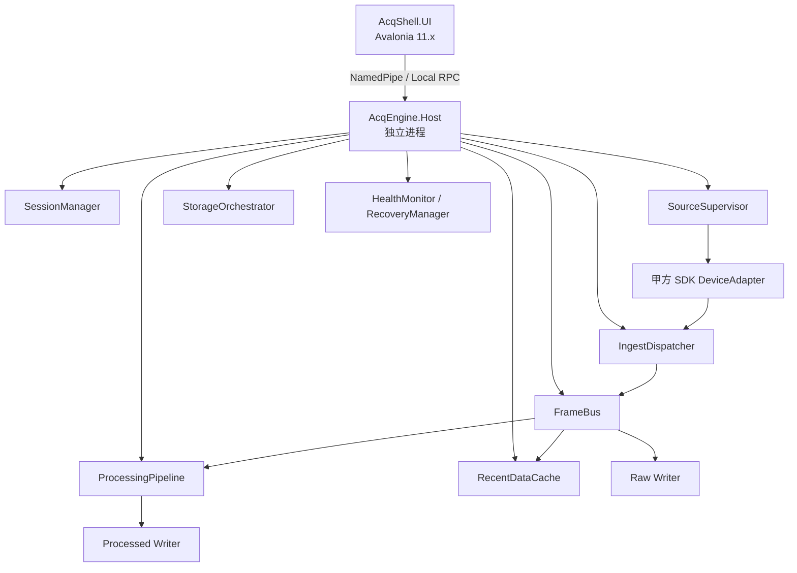
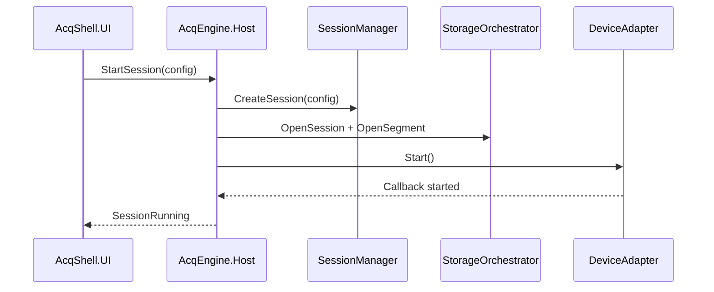
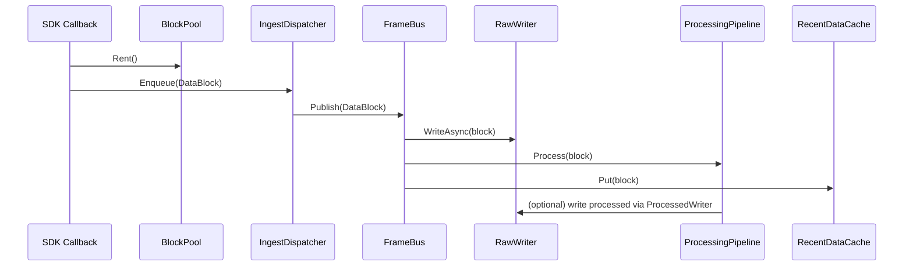
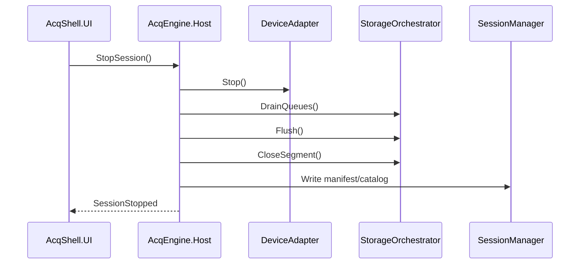

# 数据采集与实时存储系统架构方案（一期可实施版）

**项目定位**：面向甲方 SDK 回调式数据采集场景的工业数据采集与存储系统  
**技术栈约束**：Avalonia + .NET 6 + C#，需兼容 Win7 部署环境  
**文档用途**：一期开发实施、任务拆分、模块边界定义、技术选型落地  
**文档版本**：v1.0  
**日期**：2026-04-15

---

## 1. 设计目标

### 1.1 一期必须满足的目标

1. 通过**甲方 SDK 回调**采集数据。
2. 支持多台模拟仪器并发采集，**一台模拟仪器默认 16 通道**。
3. 支持以下两类场景：
   - **256 通道 × 1 MHz** 真实物理环境；
   - **最大 20000 通道 × 10 kHz** 软件虚拟环境。
4. 支持**原始通道数据**与**信号处理后的数据**同时存储。
5. 录制过程中**持续写盘**，停止时仅执行 `flush/close`，避免长时间尾部转换等待。
6. 文件命名规则支持**用户自定义**、**按时间命名**、**自动递增**、**分段命名**。
7. 提供实时监控与波形预览，但 **UI 不得阻塞采集和落盘**。
8. 架构上为后续“预处理 + 多算法压缩组合”预留扩展点，但**一期不以此为核心交付目标**。

### 1.2 一期明确不做的内容

1. 不再采用“先 bin 落盘、停止后再统一转 TDMS/HDF5”的方案。
2. 不在 SDK callback 线程中做压缩、复杂处理、文件写入、UI 刷新。
3. 不把“实时查看”建立在边写边读 HDF5/TDMS 上，实时查看优先走内存缓存。
4. 不在一期一次性实现全部后续压缩算法（ZSTD/LZ4/Snappy/Zlib/LZ4_HC/BZip2、差分/LPC 等），仅预留 `CodecPipeline` 扩展位。

---

## 2. 关键约束与选型结论

### 2.1 运行时与 UI 框架约束

由于项目要求兼容 Win7，工程上建议锁定：

- **.NET 6** 作为运行时基线；
- **Avalonia 11.x** 作为 UI 框架版本；
- 项目进入实施后应冻结对应 SDK / NuGet 版本，避免追新。

> 说明：Avalonia 官方文档指出，**Avalonia 12 仅支持 .NET 8 及以上版本**；而 Microsoft 生命周期页面显示 **.NET 6 已于 2024-11-12 结束支持**。这意味着本项目应将 `Avalonia 11.x + .NET 6` 视为“为兼容 Win7 而冻结的工程组合”，正式部署前需再次核验 Win7 目标机的运行库与依赖条件。[A1][A2]

### 2.2 存储格式结论

一期推荐采用：

1. **主推荐：TDMS 直写**（前提：已确认 NI 对应 .NET 写入能力和授权链路可用）
2. **备选：HDF5 持续追加写**（前提：接受 chunk 设计与扩展过滤器插件带来的工程复杂度）
3. **明确淘汰：bin 录完后再转 TDMS/HDF5**

### 2.3 结论背后的原因

- TDMS 的官方定位就是**用于将测量数据流式写入磁盘**，且对大文件读取可依赖 `.tdms_index` 加速；非常适合“采集中持续写盘、录完即可打开”的场景。[A3][A4]
- HDF5 并不只有 zlib。HDF5 官方明确支持 **filter pipeline**，包含标准 filter，也支持**自定义/插件式 filter**；但这些 filter 作用于 **chunked dataset**，因此需要认真设计 chunk 策略和读端兼容性。[A5][A6]
- 你们当前最核心的性能问题不是“格式名字”，而是**录制结束后还要做第二遍全量转换**。因此无论最终选 TDMS 还是 HDF5，一期都必须改成**录制过程持续写盘**。

---

## 3. 架构总览

### 3.1 总体架构



### 3.2 进程边界

#### 进程 1：`AcqShell.UI`
职责：
- 录制参数配置
- 设备状态查看
- 实时波形预览
- 历史会话查询
- 录制开始/停止控制

#### 进程 2：`AcqEngine.Host`
职责：
- SDK 回调接入
- 缓冲块管理
- 数据分发
- 原始流/处理后流写入
- 分段轮转
- 实时缓存
- 异常恢复
- 运行诊断与告警

### 3.3 为什么必须双进程

双进程不是“为了架构好看”，而是为了解决工业场景里的稳定性问题：

1. UI 重绘、绑定、图表刷新、GC 波动不应影响 SDK callback 与落盘。
2. UI 崩溃后，采集与写盘不能立即中断。
3. 后续增加服务模式、看门狗、自动恢复时，双进程更容易实施。

---

## 4. 设计原则

1. **一台模拟仪器 = 一个 Source = 16 通道**，以物理设备为基本采集单元。
2. SDK callback 线程只做“快进快出”：**拷贝 / 贴元数据 / 入队 / 返回**。
3. 任何时刻都必须优先保证：
   - 原始数据写盘
   - 再考虑处理后数据写盘
   - 再考虑网络与 UI
4. 实时显示只读 `RecentDataCache`，不直接读写文件。
5. 停止时只允许：
   - 停止新数据进入
   - drain 队列
   - flush
   - close 当前 segment
   - 更新 manifest / catalog
6. 架构提前预留：
   - `PreprocessPipeline`
   - `CodecPipeline`
   但一期默认都可为 `PassThrough`。

---

## 5. 数据模型

### 5.1 Session

`Session` 表示一次完整录制任务。

字段建议：
- `SessionId`
- `TaskName`
- `Operator`
- `BatchNo`
- `StartTime`
- `EndTime`
- `StorageFormat`
- `FileNamingTemplate`
- `Sources[]`
- `WriteRaw`
- `WriteProcessed`
- `SegmentPolicy`

### 5.2 Source

`Source` 表示一个物理或虚拟采集源。

字段建议：
- `SourceId`
- `DeviceName`
- `SdkHandle`
- `ChannelCount`
- `SampleRateHz`
- `SampleType`
- `ClockType`
- `EnabledChannels`

> 一期中，建议天然按照“每台模拟仪器 16 通道”建模，不在 callback 热路径中做跨设备大拼帧。

### 5.3 Stream

至少定义以下流类型：

- `Raw`
- `Processed`
- `Event`
- `State`

一期最核心的是：
- `Raw`：原始通道数据
- `Processed`：信号处理后的数据

### 5.4 Block

`Block` 是系统内部最小传输单元。

建议优先贴近 SDK callback 粒度；若回调过碎，则在 `IngestDispatcher` 中做轻量聚合（如聚合为 5ms 或 10ms 逻辑块）。

```csharp
public readonly record struct DataBlockHeader(
    Guid SessionId,
    int SourceId,
    StreamKind StreamKind,
    long Sequence,
    long StartSampleIndex,
    long SampleCountPerChannel,
    int ChannelCount,
    SampleType SampleType,
    long DeviceTimestampNs,
    long HostTimestampNs);
```

`Payload` 建议单独放在租用的缓冲块中，不放入 header。

### 5.5 Segment

`Segment` 是文件切段单位。

建议一期默认策略：
- **按时间切段**：`1 ~ 2 秒` 一段；
- **按大小切段**：`512 MB` 上限；
- 先到先切。

切段目的：
- 停止时只 close 当前小段，减少等待；
- 异常恢复只需检查最后一个未封口分段；
- 历史回放和检索更快。

---

## 6. 采集与数据流设计

### 6.1 采集入口

每个模拟仪器由一个 `SdkDeviceAdapter` 负责对接甲方 SDK。

#### callback 热路径伪代码

```csharp
void OnSdkDataArrived(IntPtr srcPtr, int bytes, long deviceTs, long sampleIndex)
{
    var block = _blockPool.Rent(bytes);
    NativeMemory.Copy(srcPtr, block.BufferPtr, (nuint)bytes);

    block.Header = new DataBlockHeader(
        _sessionId,
        _sourceId,
        StreamKind.Raw,
        NextSequence(),
        sampleIndex,
        CalcSamplesPerChannel(bytes),
        _channelCount,
        _sampleType,
        deviceTs,
        TimestampNs.Now());

    _sourceQueue.Writer.TryWrite(block);
}
```

#### callback 禁止事项

在 callback 中**禁止**：
- 文件写入
- HDF5 / TDMS API 调用
- 压缩
- FFT / 滤波等复杂处理
- UI 绑定与界面刷新
- 跨设备同步阻塞等待

### 6.2 IngestDispatcher

职责：
- 从 `SourceQueue[sourceId]` 拉取数据块；
- 保证**单 Source 内部顺序性**；
- 转发给 `FrameBus`；
- 记录回调滞后、队列深度、积压时间。

### 6.3 FrameBus

统一的内部数据分发总线。

分发目标：
- `RawWriter`
- `ProcessingPipeline`
- `RecentDataCache`
- `DiagnosticsCounter`

原则：
- 同一份块数据尽量共享，避免多次复制；
- 通过引用计数或生命周期管理归还块池。

---

## 7. 线程与队列模型

### 7.1 线程划分

- `SdkCallbackThread[n]`：每个 Source 的 SDK 回调线程
- `IngestDispatcherThread`
- `RawWriterThread`
- `ProcessingWorkerPool`
- `ProcessedWriterThread`
- `UiSnapshotThread`
- `HealthMonitorThread`

### 7.2 队列划分

- `SourceQueue[sourceId]`
- `RawWriteQueue`
- `ProcessQueue`
- `ProcessedWriteQueue`
- `UiPreviewQueue`

### 7.3 优先级策略

优先级从高到低：
1. `RawWriteQueue`
2. `ProcessedWriteQueue`
3. `UiPreviewQueue`

### 7.4 背压策略

当磁盘、处理或 UI 路径跟不上时：

1. 优先降级 UI 刷新频率；
2. 丢弃中间预览帧，但保留统计摘要；
3. 对处理后流发出积压告警；
4. 原始数据写盘路径不允许静默丢块；
5. 若会话配置要求“处理后数据必须同时完整存储”，则应在录制前做**能力校验**；校验不通过，应拒绝启动。

---

## 8. 内存与缓存设计

### 8.1 BlockPool

建议使用预分配缓冲池：

- 引擎进程启用 `Server GC`
- `ArrayPool<byte>` 或非托管内存池
- `DataBlock` 对象复用
- 使用引用计数控制归还时机

### 8.2 两级缓存

#### 8.2.1 FullBlockCache
保存最近 `2 ~ 5 秒` 的完整块，供：
- 刚停止后秒级回看
- 处理模块短窗口回溯
- 故障现场分析

#### 8.2.2 DisplayCache
保存抽稀后的显示数据，供：
- 30~60 秒实时波形
- 缩放、平移、概览

### 8.3 引用计数建议

一个块可能同时被：
- Raw Writer
- Processing Pipeline
- RecentDataCache
引用。

建议 `DataBlockHandle` 支持：
- `AddRef()`
- `Release()`
- 当引用计数归零时归还 `BlockPool`

---

## 9. 存储架构

### 9.1 存储抽象目标

采集主链路不关心最终写入的是 TDMS 还是 HDF5。

### 9.2 统一接口

```csharp
public interface IContainerWriter : IAsyncDisposable
{
    ValueTask OpenSessionAsync(SessionContext session, CancellationToken ct);
    ValueTask OpenSegmentAsync(StreamKind streamKind, int segmentNo, CancellationToken ct);
    ValueTask WriteBlockAsync(in DataBlock block, CancellationToken ct);
    ValueTask FlushAsync(CancellationToken ct);
    ValueTask CloseSegmentAsync(CancellationToken ct);
    ValueTask CloseSessionAsync(CancellationToken ct);
}
```

### 9.3 StorageOrchestrator

职责：
- 读取配置，实例化 `TdmsWriter` 或 `Hdf5Writer`
- 分别管理 `RawWriter` 与 `ProcessedWriter`
- 控制 segment 轮转
- 记录写入指标
- 在停止时协调 `Flush/Close`

---

## 10. TDMS 直写方案（一期主推荐）

### 10.1 适用条件

- 已确认 TDMS 直写路线在当前项目中可用；
- NI 对应 .NET 类库、运行时、授权链路已打通；
- 录完即开、流式写盘是首要目标。

> NI 官方资料指出 TDMS 适合测量数据流式写盘；同时 Measurement Studio 提供了 .NET 工具链与 TDMS 写入能力。[A3][A4]

### 10.2 文件组织

```text
/DataRoot/
  /20260410/
    /Task_A/
      session.manifest.json
      session.catalog.db
      /raw/
        Task_A_Raw_20260410_153012_0001_seg0001.tdms
        Task_A_Raw_20260410_153013_0001_seg0002.tdms
      /proc/
        Task_A_Proc_20260410_153012_0001_seg0001.tdms
        Task_A_Proc_20260410_153013_0001_seg0002.tdms
```

### 10.3 TDMS 内部映射

- `File` = 一个 segment
- `Group` = 一个 source（一个模拟仪器）
- `Channel` = source 下各通道

示例：

```text
File
 ├─ Group: source_0001
 │   ├─ ch01
 │   ├─ ch02
 │   └─ ch16
 ├─ Group: source_0002
 │   └─ ch01..ch16
 └─ ...
```

### 10.4 元数据建议

**文件级属性**：
- `SessionId`
- `TaskName`
- `StartTime`
- `StorageFormatVersion`
- `SampleType`

**Group 级属性**：
- `SourceId`
- `DeviceName`
- `SampleRateHz`
- `ChannelCount`

**Channel 级属性**：
- `ChannelNo`
- `ChannelName`
- `Unit`
- `Scale`
- `Calibration`

### 10.5 为什么不再走 `bin -> tdms`

因为这条路会在录制完成后再做一遍：
- 全量读 bin
- 再全量写 tdms
- 再生成可打开结构/索引

本质上仍是“停止后第二次全量转换”，会直接导致尾部等待随数据量线性增长。

---

## 11. HDF5 持续追加写方案（一期备选）

### 11.1 适用条件

- 当前无法可靠实施 TDMS 直写；
- 更看重统一建模、自描述结构、原始/处理后/元数据统一组织；
- 接受 chunk 策略调优与潜在插件兼容性问题。

### 11.2 HDF5 关键事实

- HDF5 支持 **filter pipeline**，不仅限于 zlib；
- 支持标准 filter，也支持**自定义/插件式 filter**；
- filter 作用于 **chunked datasets**；
- 可扩展数据集也依赖 **chunking**。[A5][A6]

### 11.3 文件组织

```text
/Task_A/
  session.manifest.json
  session.catalog.db
  /raw/
    Task_A_Raw_seg0001.h5
    Task_A_Raw_seg0002.h5
  /proc/
    Task_A_Proc_seg0001.h5
    Task_A_Proc_seg0002.h5
```

### 11.4 HDF5 内部结构建议

```text
/meta/session
/meta/channel_map
/raw/source_0001/data
/raw/source_0001/index
/raw/source_0002/data
/proc/source_0001/data
/proc/source_0001/index
/events
```

### 11.5 dataset 设计建议

`/raw/source_0001/data`
- 维度：`[time, channel]`
- `channel = 16` 固定
- `time` 可扩展
- chunked
- append 模式持续写入

`/raw/source_0001/index`
- 记录 block 边界
- 记录 sample range
- 记录时间戳
- 供回放快速定位

### 11.6 一期为什么不建议把未来多算法压缩完全押在 HDF5 上

虽然 HDF5 支持 filter plugin，但非标准 filter 需要：
- 写端部署对应插件；
- 读端同样具备对应插件；
- 团队维护插件版本兼容性。

所以一期建议：
- 先实现 `PassThrough` 或标准压缩能力；
- 将“预处理 + 多算法压缩组合”封装到独立 `CodecPipeline`；
- 不把后续全部需求耦合到 HDF5 原生 filter 机制里。

---

## 12. 推荐决策（ADR）

### ADR-001：一期主存储格式

**决策**：优先采用 **TDMS 直写**。  
**前提**：NI 对应 .NET 写入能力、运行时与授权可用。  
**原因**：
- 更贴合“流式写盘、录完即开”的当前主目标；
- file/group/channel 层级自然适配“按设备/按通道”组织方式；
- 可避免“停止后转格式”造成的尾部等待。

**备选**：若 TDMS 直写链路不可用，则切换为 **HDF5 持续追加写**。

**显式放弃**：`bin -> TDMS/HDF5` 录后转换链路。

### ADR-002：采集数据最小建模单元

**决策**：一台模拟仪器 = 一个 `Source` = 16 通道。  
**原因**：
- 与甲方 SDK callback 边界一致；
- 热路径不强行跨设备拼帧；
- 故障定位、扩容和调试更清晰。

### ADR-003：实时预览数据源

**决策**：实时预览只读内存缓存，不直接读写文件。  
**原因**：
- 降低文件 I/O 对 UI 的耦合；
- 避免边写边读复杂性；
- 更利于后续做抽稀、最值缓存、缩放优化。

---

## 13. 命名策略设计

### 13.1 目标

满足甲方要求：
- 用户自定义文件命名规则
- 按存储时间命名
- 文件名自动递增
- 分段号自动递增

### 13.2 命名接口

```csharp
public interface IFileNamingPolicy
{
    string BuildSessionDirectory(SessionContext session);
    string BuildSegmentFileName(SessionContext session, StreamKind stream, int segmentNo);
}
```

### 13.3 模板语法建议

支持占位符：
- `{TaskName}`
- `{Date:yyyyMMdd}`
- `{StartTime:HHmmss}`
- `{Stream}`
- `{AutoInc:0000}`
- `{SegmentNo:0000}`
- `{DeviceGroup}`
- `{Operator}`
- `{BatchNo}`

示例模板：

```text
{TaskName}_{Stream}_{Date:yyyyMMdd}_{StartTime:HHmmss}_{AutoInc:0000}_seg{SegmentNo:0000}
```

示例生成结果：

```text
BearingTest_Raw_20260410_153012_0001_seg0003.tdms
```

### 13.4 行为要求

- 自动清洗非法字符
- 路径长度保护
- 重名自动递增
- 录制前支持文件名预览
- 录制开始后锁定本次 session 的命名策略

---

## 14. Session 索引与检索

### 14.1 `session.manifest.json`

记录：
- Session 基本信息
- 存储格式
- Source 列表
- Stream 配置
- Segment 列表
- 命名模板
- 统计信息
- 运行结束状态（Completed / Recovered / Failed）

### 14.2 `session.catalog.db`（SQLite）

记录：
- 每个 segment 的路径
- stream 类型
- source 范围
- 起止时间
- sample 范围
- channel map
- event / alarm / operator action

### 14.3 作用

- 打开历史会话时无需遍历所有大文件
- 回放时可按时间快速定位 segment
- 支持 UI 会话检索和列表展示
- 为异常恢复提供结构化依据

---

## 15. 处理流水线

### 15.1 设计原则

- 原始流优先落盘
- 处理后流由并行派生路径产生
- 处理模块可插拔
- 处理链不阻塞 Raw Writer

### 15.2 接口草图

```csharp
public interface IProcessor
{
    string Name { get; }
    bool Enabled { get; }
    void Process(in DataBlock rawBlock, IProcessedBlockSink sink);
}
```

### 15.3 一期建议处理模块

1. `PassThroughProcessor`
2. `DownsampleProcessor`
3. `EnvelopeProcessor`（可选）
4. `BasicStatsProcessor`（均值、峰值、RMS 等）

### 15.4 为后续压缩需求预留的扩展槽

```text
RawBlock
  -> PreprocessPipeline   // 一期默认空或 PassThrough
  -> CodecPipeline        // 一期默认 PassThrough
  -> ContainerWriter
```

后续甲方提出的需求可逐步落入：
- `PreprocessPipeline`：一阶/二阶差分、LPC
- `CodecPipeline`：ZSTD、LZ4、Snappy、Zlib、LZ4_HC、BZip2
- `CodecChain`：例如 `Diff1 + ZSTD`
- 配置文件动态启停与参数化

但**一期不要求完整实现这些算法**，只要求架构上不把后路堵死。

---

## 16. 配置设计

建议全部运行参数集中到 JSON 配置文件。

### 16.1 示例配置

```json
{
  "session": {
    "taskName": "BearingTest",
    "operator": "张三",
    "batchNo": "20260410-A"
  },
  "acquisition": {
    "expectedSources": 16,
    "defaultChannelsPerSource": 16,
    "sampleType": "Int16"
  },
  "storage": {
    "primaryFormat": "TDMS",
    "segmentSeconds": 1,
    "segmentMaxBytes": 536870912,
    "writeRaw": true,
    "writeProcessed": true,
    "basePath": "D:\\AcqData"
  },
  "naming": {
    "template": "{TaskName}_{Stream}_{Date:yyyyMMdd}_{StartTime:HHmmss}_{AutoInc:0000}_seg{SegmentNo:0000}"
  },
  "ui": {
    "previewSeconds": 30,
    "displayDecimation": 2000,
    "maxRefreshHz": 10
  },
  "processing": {
    "enabled": true,
    "processors": [ "PassThrough", "BasicStats" ]
  },
  "codec": {
    "enabled": false,
    "preprocess": [],
    "compressor": "None",
    "parameters": {}
  }
}
```

### 16.2 配置要求

- 配置文件启动时加载，录制中途禁止修改核心存储策略
- UI 允许编辑，但启动录制时应生成本次 session 的最终快照
- manifest 中保存本次实际生效的配置副本

---

## 17. 项目分层与目录结构

### 17.1 Solution 建议

```text
src/
  AcqShell.UI
  AcqShell.Contracts
  AcqEngine.Host
  AcqEngine.Core
  AcqEngine.DeviceSdk
  AcqEngine.Storage.Abstractions
  AcqEngine.Storage.Tdms
  AcqEngine.Storage.Hdf5
  AcqEngine.Processing
  AcqEngine.Diagnostics
  AcqEngine.Replay
  AcqEngine.Tests
```

### 17.2 各项目职责

#### `AcqShell.UI`
- Avalonia MVVM
- 配置页、监控页、波形页、历史会话页

#### `AcqShell.Contracts`
- UI 与引擎的 DTO
- 命令、状态、通知消息

#### `AcqEngine.Host`
- 进程入口
- DI 组装
- 配置加载
- 生命周期管理

#### `AcqEngine.Core`
- Session / Source / Stream / Block / Segment 模型
- 队列与调度
- SessionManager
- IngestDispatcher
- FrameBus
- RecentDataCache

#### `AcqEngine.DeviceSdk`
- 甲方 SDK 适配
- 设备发现与连接
- callback 转换为 `DataBlock`

#### `AcqEngine.Storage.Abstractions`
- `IContainerWriter`
- `IFileNamingPolicy`
- SegmentPolicy

#### `AcqEngine.Storage.Tdms`
- `TdmsWriter`
- TDMS 元数据映射
- Segment 轮转

#### `AcqEngine.Storage.Hdf5`
- `Hdf5Writer`
- chunk 策略
- dataset append

#### `AcqEngine.Processing`
- Processor 接口
- PassThrough / Downsample / Stats

#### `AcqEngine.Diagnostics`
- 日志、性能指标、告警
- callback 时延、队列深度、写入吞吐

#### `AcqEngine.Replay`
- 历史会话索引加载
- 按时间段回放
- 对接 UI 查询

#### `AcqEngine.Tests`
- SDK 模拟器
- 压测
- 故障演练

---

## 18. 关键接口草图

```csharp
public enum StreamKind { Raw, Processed, Event, State }
public enum StorageFormat { Tdms, Hdf5 }

public sealed class SessionContext
{
    public Guid SessionId { get; init; }
    public string TaskName { get; init; } = "";
    public DateTimeOffset StartTime { get; init; }
    public IReadOnlyList<SourceDescriptor> Sources { get; init; } = Array.Empty<SourceDescriptor>();
    public StorageFormat StorageFormat { get; init; }
}

public sealed class SourceDescriptor
{
    public int SourceId { get; init; }
    public string DeviceName { get; init; } = "";
    public int ChannelCount { get; init; }
    public double SampleRateHz { get; init; }
}

public interface IAcquisitionSource
{
    int SourceId { get; }
    void Start();
    void Stop();
    event Action<DataBlock> BlockArrived;
}

public interface IFrameBus
{
    void Publish(in DataBlock block);
}

public interface IContainerWriter : IAsyncDisposable
{
    ValueTask OpenSessionAsync(SessionContext session, CancellationToken ct);
    ValueTask OpenSegmentAsync(StreamKind streamKind, int segmentNo, CancellationToken ct);
    ValueTask WriteBlockAsync(in DataBlock block, CancellationToken ct);
    ValueTask FlushAsync(CancellationToken ct);
    ValueTask CloseSegmentAsync(CancellationToken ct);
    ValueTask CloseSessionAsync(CancellationToken ct);
}

public interface IRecentDataCache
{
    void Put(in DataBlock block);
    PreviewFrame GetPreview(int sourceId, TimeSpan window);
}

public interface IFileNamingPolicy
{
    string BuildSessionDirectory(SessionContext session);
    string BuildSegmentFileName(SessionContext session, StreamKind stream, int segmentNo);
}
```

---

## 19. 关键时序

### 19.1 开始录制



### 19.2 数据进入与分发



### 19.3 停止录制



---

## 20. 启停、异常与恢复

### 20.1 正常停止

停止路径只允许：
1. 停止 SDK callback
2. 停止接收新块
3. drain 内部队列
4. Raw/Processed writer flush
5. close 当前 segment
6. 更新 manifest / catalog 状态

### 20.2 异常恢复

启动时检查：
- 是否存在 `session.lock`
- 最后一个 segment 是否为未封口状态
- manifest / catalog / 实际文件是否一致

恢复策略：
- 尽量保留已成功写入的数据
- 仅修复最后一个未完成 segment 的元数据状态
- 标记 session 为 `Recovered`
- 不做全量重扫重建

### 20.3 运行期告警项

至少监控：
- SDK callback 时延异常
- SourceQueue 深度
- RawWriteQueue 深度
- ProcessQueue 深度
- 磁盘空间不足
- writer 吞吐低于阈值
- UI 降级触发次数

---

## 21. 性能预算与硬件建议

### 21.1 粗略吞吐估算（以 Int16 为例）

- `256 通道 × 1 MHz × 2 Byte ≈ 512 MB/s`
- `20000 通道 × 10 kHz × 2 Byte ≈ 400 MB/s`

如果原始与处理后数据都接近全量保存，则总吞吐可能达到：
- `800 MB/s ~ 1 GB/s`

### 21.2 部署建议

- 独立 NVMe SSD 作为数据盘
- 32 GB 以上内存
- UI 与引擎进程分离
- 引擎采用 `Server GC`
- 预留 2~5 秒完整块缓存
- 分段切得足够勤，避免单文件过大

### 21.3 录制前能力校验

录制开始前应校验：
- 设备数量
- 每设备通道数
- 总采样率
- 原始/处理后是否同时存
- 目标磁盘可持续吞吐
- 剩余磁盘空间
- 预计单小时数据量

校验不通过时，应直接阻止录制启动。

---

## 22. 开发计划与任务拆分

### 22.1 第一阶段：主链路跑通

1. 双进程骨架（UI / Engine）
2. SDK callback 封装
3. `DataBlock` + `BlockPool`
4. `SessionManager`
5. `IContainerWriter` 抽象
6. `TdmsWriter` 或 `Hdf5Writer` 首个实现
7. `FileNamingPolicy`
8. 基础状态 UI

**阶段验收**：
- 可从 SDK callback 收数
- 可持续写盘
- 停止时无长时间尾部转换

### 22.2 第二阶段：补齐处理与检索

1. `ProcessingPipeline`
2. `ProcessedWriter`
3. `manifest.json`
4. `catalog.db`
5. 历史会话列表与简单回放

**阶段验收**：
- 原始/处理后双流写盘
- 历史会话可快速打开和定位

### 22.3 第三阶段：工业化完善

1. HealthMonitor
2. 背压与降级策略
3. 异常恢复
4. 磁盘空间告警
5. 压测与故障演练

**阶段验收**：
- 磁盘慢写、UI 卡顿、处理链积压时，Raw 路径仍可稳定运行

### 22.4 第四阶段：为二期压缩做铺垫

1. `PreprocessPipeline` 抽象
2. `CodecPipeline` 抽象
3. 配置驱动的 Codec 装配
4. 单元测试与压测基线

**阶段验收**：
- 在不改动采集主链路的前提下，可以接入 `PassThrough`/`Diff1`/`ZSTD` 等实现

---

## 23. 风险与对策

### 风险 1：TDMS 直写链路受 NI 授权或 .NET 类库约束

**对策**：
- 在项目第 1 周就做 TDMS 直写 POC；
- 同时保留 `Hdf5Writer` 抽象位；
- 不将采集主链路耦合到具体格式实现。

### 风险 2：HDF5 chunk 策略不合理导致性能不稳

**对策**：
- chunk 大小基于 callback 批次或其整数倍；
- 建立小规模与大规模数据集压测样本；
- 不在一期引入复杂 filter plugin 组合。

### 风险 3：UI 实时显示拖累采集

**对策**：
- UI 只读 DisplayCache；
- 引入刷新频率上限；
- 必要时按 source 层级抽稀。

### 风险 4：处理后流拖慢原始落盘

**对策**：
- 原始落盘和处理路径完全解耦；
- RawWriter 独立线程和队列；
- 录制开始前做能力校验。

---

## 24. 最终实施建议

### 24.1 一期推荐方案

**推荐：`AcqEngine 双进程 + Source=模拟仪器(16ch) + Raw/Processed 双流 + 分段持续写盘 + RecentDataCache + TDMS 直写`**

若 TDMS 直写链路无法可靠落地，则切换为：

**`AcqEngine 双进程 + Source=模拟仪器(16ch) + Raw/Processed 双流 + 分段持续写盘 + RecentDataCache + HDF5 持续追加写`**

### 24.2 最重要的原则

1. 不再做录制结束后的全量二次转换。
2. 先把“采集 + 缓冲 + 持续写盘 + 快速停止”做稳。
3. 把未来“差分/LPC/ZSTD/LZ4/Snappy/Zlib/LZ4_HC/BZip2”能力放到独立 `CodecPipeline` 中，而不是反过来决定一期主架构。

---

## 25. 附录：建议的首批开发任务列表

### A. 引擎核心
- [ ] 建立 `AcqEngine.Host`
- [ ] 建立 `SessionManager`
- [ ] 建立 `DataBlock` 与 `BlockPool`
- [ ] 建立 `IngestDispatcher`
- [ ] 建立 `FrameBus`
- [ ] 建立 `RecentDataCache`

### B. SDK 适配
- [ ] 封装甲方 SDK 初始化/启动/停止
- [ ] 定义 callback 到 `DataBlock` 的转换
- [ ] 建立单设备 16 通道模拟压测工具

### C. 存储
- [ ] 定义 `IContainerWriter`
- [ ] 完成 `TdmsWriter` POC
- [ ] 完成 `Hdf5Writer` Skeleton
- [ ] 实现 `FileNamingPolicy`
- [ ] 实现 `segment` 轮转与 manifest

### D. UI
- [ ] 启停控制页
- [ ] 设备状态页
- [ ] 实时波形预览页
- [ ] 历史会话列表页

### E. 质量保障
- [ ] 压测脚本：256 通道 × 1 MHz
- [ ] 压测脚本：20000 通道 × 10 kHz 虚拟模式
- [ ] 停止耗时统计
- [ ] 磁盘写入吞吐监控
- [ ] 队列积压监控

---

## 26. 参考资料

- [A1] Avalonia Docs, *Breaking changes in Avalonia 12*: Avalonia 12 仅支持 .NET 8 及以上。  
  <https://docs.avaloniaui.net/docs/avalonia12-breaking-changes>
- [A2] Microsoft Learn, *.NET and .NET Core Lifecycle*: .NET 6 LTS 于 2024-11-12 结束支持。  
  <https://learn.microsoft.com/zh-cn/lifecycle/products/microsoft-net-and-net-core>
- [A3] NI, *TDM Streaming*: TDMS 用于读写二进制测量文件。  
  <https://www.ni.com/docs/en-US/bundle/labview-api-ref/page/menus/categories/programming/file-io/plat-tdms-mnu.html>
- [A4] NI, *NI TDMS 文件格式*: TDMS 为向磁盘存储测量数据而优化。  
  <https://www.ni.com/zh-cn/support/documentation/supplemental/06/the-ni-tdms-file-format.html>
- [A5] HDF Group, *HDF5 Plugins*: HDF5 支持运行时可加载的 filter plugin 与自定义 filter。  
  <https://support.hdfgroup.org/documentation/hdf5/latest/_h5_p_l__u_g.html>
- [A6] HDF Group, *HDF5 Filters (H5Z)*: filter pipeline 作用于 chunked datasets。  
  <https://support.hdfgroup.org/documentation/hdf5/latest/group___h5_z.html>

